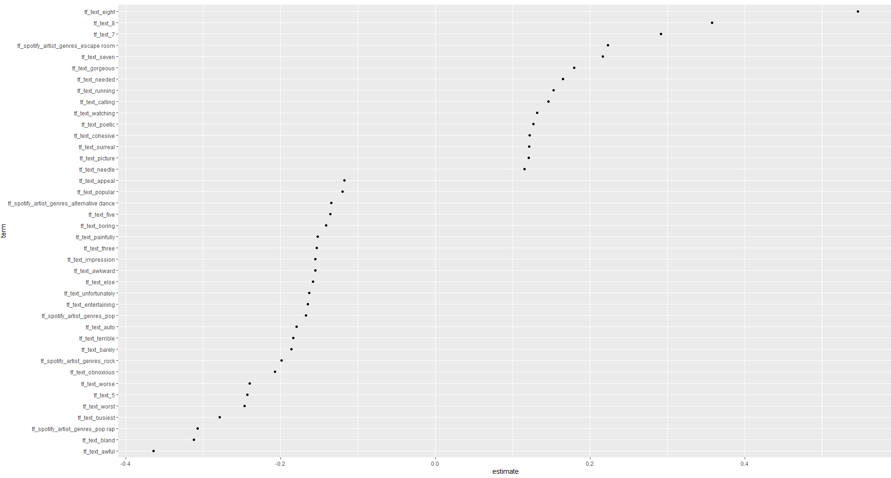

# Fantano Album Score Prediction Project

## Purpose

I love Anthony Fantano, *the internet's bussiest music nerd*. He reviews music on his Youtube channel, [The Needle Drop](https://www.youtube.com/channel/UCt7fwAhXDy3oNFTAzF2o8Pw). He also has a [website](https://www.theneedledrop.com/) where he lists his reviews. I wanted to see if I could predict his scores for albums based on the text of his reviews. I also wanted to build a web application where users could input their own reviews and get a predicted score, based on his reviews.

So far I have got the text from his reviews on YouTube, and I have extracted the scores from the descriptions of the videos. I have trained a Support Vector Machine (SVM) on this dataset and found out which single word terms are associated with high scoring albums:



This was fun, but ultimately not super surprising. What I think would be even more fun would be to expand my models (simple lasso model, fine-tuned BERT model with a regression head), emsemble these, and then make a web application where users can input their own reviews and get a predicted score. This would also be a good opportunity to learn about deploying models to an API and building a front-end application.

If I feel very inspired, I might automate it with GitHub actions so that it updates every month or so with new reviews.

## Context

Fantano reviews music. The majority of his reviews are albums. He has a [website](https://www.theneedledrop.com/) which lists his reviews. He has a [Youtube channel](https://www.youtube.com/channel/UCt7fwAhXDy3oNFTAzF2o8Pw) that he uploads his reviews on. See a sample below.

<iframe width="560" height="315" src="https://www.youtube.com/embed/TYE930nQfig?controls=0" title="YouTube video player" frameborder="0" allow="accelerometer; autoplay; clipboard-write; encrypted-media; gyroscope; picture-in-picture" allowfullscreen></iframe>

## Structure

### 1. Acquiring Data

- Set up a project on Google Cloud Platform.
- Enable the YouTube Data API and obtain an API key.
- Use the YouTube Data API to retrieve video transcripts and descriptions from Anthony Fantano's channel.
- Extract review scores from video descriptions.

### 2. Processing Raw Data

- Clean and preprocess the transcripts to remove any irrelevant information.
- Extract review text and associated scores.
- Store the processed data in a structured format (e.g., CSV or database).

### 3. Exploratory Data Analysis

- Load and explore the dataset to understand its characteristics.
- Perform basic statistics to find any patterns or trends in the data.
- Visualize the data to gain insights.

### 4. Building Models

#### 4.1 Lasso Regression Model

- Preprocess text data for modeling.
- Split the data into training and testing sets.
- Train a Lasso regression model on the training data.
- Evaluate the model's performance on the testing data.

#### 4.2 Support Vector Machine Model

- Train a SVM model on the training data.
- Evaluate the model's performance on the testing data.

#### 4.3 Fine-tuning a Pre-trained Model

- Load a pre-trained BERT model.
- Fine-tune the model on your dataset.
- Evaluate the model's performance.

#### 4.4 Ensemble Model

- Combine the predictions from the Lasso model, SVM model, and fine-tuned BERT model.
- Evaluate the ensemble model's performance.

### 5. Testing

- Test the ensemble model on a separate test set to validate its performance.
- Make any necessary adjustments to the models or ensemble method based on test results.

### 6. Deploying to an API

- Save the trained ensemble model.
- Set up a web server with an API endpoint to handle review scoring requests.
- Load the trained ensemble model in the server and handle incoming requests.

### 7. Front-End Development

- Set up a SvelteKit project for the front-end application.
- Create a review form where users can input their reviews.
- Implement functionality to send the review to the API endpoint and display the predicted score.

### 8. Deployment

- Deploy the front-end application to a web server or cloud platform.
- Ensure that the API endpoint is accessible from the front-end application.
- Test the end-to-end functionality of the application.

### 9. Maintenance

- Monitor the application for any issues or errors.
- Make updates as necessary based on user feedback or changes to the YouTube Data API.

## Project Structure

### 1. Directory Structure

A typical project structure might look like this:

```
album-review-predictor/
│
├── .github/workflows/     # Contains GitHub action definitions
│   └── main.yml           # Main GitHub Actions workflow
│
├── data/
│   ├── raw/               # Unprocessed data, as obtained from the API
│   ├── processed/         # Data after cleaning and filtering
│   └── features/          # Data that will be fed into the model
│
├── notebooks/             # Jupyter notebooks for exploration and analysis
│   └── EDA.ipynb          # For Exploratory Data Analysis (EDA)
│
├── src/                   # Source code for the project
│   ├── __init__.py        # Makes src a Python module
│   ├── config.py          # Configuration settings and constants
│   ├── data_acquisition.py# Script to fetch and filter data from YouTube API
│   ├── data_processing.py # Script to process and prepare data
│   ├── feature_extraction.py # Script for feature extraction from transcripts
│   ├── model.py           # Machine learning model definition
│   └── main.py            # Main script that orchestrates the workflow
│
├── models/                # Trained model files
│   └── predictor_model.pkl # Pickle file of the trained model
│
├── transcripts/           # Downloaded transcripts of the album reviews
│
├── requirements.txt       # Project dependencies
└── README.md              # Project overview and instructions
```

### 2. Data Flow

Now, let's describe how data would typically move through this workflow:

#### a. Data Acquisition:

- **GitHub Actions**: The `.github/workflows/main.yml` would be configured to periodically trigger the data acquisition script.
- **Script `data_acquisition.py`**: This script is responsible for calling the YouTube Data API, filtering videos with "album review" in the title, and downloading the necessary data. The raw data would be saved in `data/raw/`.

#### b. Data Processing:

- **Script `data_processing.py`**: Processes the raw data to extract the album scores using regex and saves the processed data in `data/processed/`.

#### c. Transcript Acquisition:

- The transcript for each album review is obtained using a third-party application, which should be downloaded and saved in the `transcripts/` directory.

#### d. Feature Extraction:

- **Script `feature_extraction.py`**: Extracts features from the transcripts required for training the machine learning model and saves them in `data/features/`.

#### e. Model Training:

- **Notebook `EDA.ipynb`**: Contains exploratory data analysis to inform the feature selection and model development process.
- **Script `model.py`**: Defines the machine learning model and includes code for training it. The trained model is serialized and saved in the `models/` directory as `predictor_model.pkl`.

#### f. Prediction:

- **Script `main.py`**: This is the main entry point for running the entire workflow after the initial data setup. It coordinates the data processing, feature extraction, model training, and serialization.

#### g. Versioning and Reproducibility:

- **`requirements.txt`**: This file contains all the dependencies for your project, ensuring that anyone can replicate your environment.
- **`README.md`**: Provides an overview of the project, instructions on how to set up and run the project, and any other necessary documentation.

### 3. Version Control

- Regularly commit and push changes to the GitHub repository to maintain version control and backup.
- Use tags for different versions of your model and data processing scripts.

### 4. Automation and Monitoring

- Automate as much of the workflow as possible using scripts and GitHub Actions. This can include data fetching, processing, training, and even periodic retraining of the model.
- Monitor the automated processes for any failures or issues that may require intervention.

### 5. Testing and Validation

- Implement tests for your data processing and feature extraction codes to ensure they are functioning as expected.
- Validate your model's performance using appropriate metrics and hold-out datasets or cross-validation techniques.

By structuring your project in a clear, modular way, you make it easier to maintain and update, as well as enabling collaboration with others. Always document your code and decisions, and keep your repository's README updated with the latest information about your project's setup and status.


## Getting help

Certainly! Below is a short description of your project that you can use:

---

### Album Review Score Predictor Project

**Project Overview:**
The Album Review Score Predictor is a data science project aimed at extracting musical album reviews from a specific YouTube channel and predicting the album scores based on the content of the reviews. This project leverages the YouTube Data API to fetch videos, employs regex for extracting scores from video descriptions, and uses a third-party application to retrieve the transcripts of the reviews.

**Workflow:**
1. **Data Acquisition**: Videos are periodically fetched from the YouTube channel via GitHub Actions, filtering for those with "album review" in the title.
2. **Score Extraction**: Album scores are extracted from the video descriptions using regex patterns.
3. **Transcript Retrieval**: Transcripts are obtained for the filtered videos, providing detailed review text.
4. **Feature Engineering**: Textual features are extracted from the transcripts, which serve as input for the machine learning model.
5. **Model Training**: A machine learning model is trained to predict album scores based on the extracted features from the reviews.
6. **Prediction**: The model generates score predictions for new album reviews.

**Repository Structure:**
- `.github/workflows/` for GitHub action definitions
- `data/` containing raw, processed, and feature data
- `notebooks/` for Jupyter notebooks like EDA
- `src/` with Python scripts for each step of the workflow
- `models/` for storing trained machine learning models
- `transcripts/` where the review transcripts are saved
- `requirements.txt` for project dependencies
- `README.md` for project documentation

**Current Assistance Requirement:**
I am requesting help with a specific file within this project setup. The file in question is `[FILENAME]`, located in the `[DIRECTORY]` directory. The issue I'm facing is `[BRIEF DESCRIPTION OF THE ISSUE]`, and I require guidance on `[SPECIFIC ASPECT]`.

---

When asking for help, you'll replace `[FILENAME]`, `[DIRECTORY]`, `[BRIEF DESCRIPTION OF THE ISSUE]`, and `[SPECIFIC ASPECT]` with the relevant details of the file and the help you need. This description gives a concise but comprehensive view of your project, which will be useful for others to understand the context and provide targeted assistance.